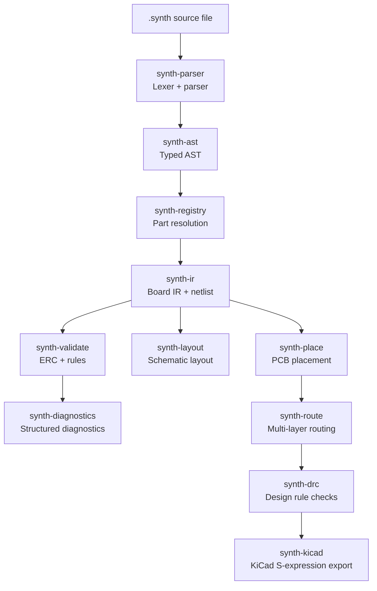

# Compiler Architecture

> [!NOTE]
> This section is for **contributors** to the Synth open-source project. If you're a user looking to build designs, see the [Quick Start Guide](/user-guide/quick-start) instead.

The Synth compiler is a pipeline of independent Rust crates. Each crate owns one stage, accepting the previous stage's output as input and producing a well-defined data structure for the next.



---

## Compilation Stages

### 1. Parsing (`synth-parser`)

Hand-written recursive-descent parser with error recovery — continues past syntax errors to surface multiple issues per run.

**Input:** UTF-8 `.synth` source text  
**Output:** `synth_ast::DesignFile`

### 2. AST (`synth-ast`)

Defines the full typed AST node tree. Kept close to the source syntax; never modified after parsing. All semantic passes work on the IR.

Key nodes: `BoardNode`, `ComponentNode`, `ConnectNode`, `DiffPairNode`, `KeepoutNode`, `PlacementHintNode`.

### 3. Part Resolution (`synth-registry`)

Resolves each component's `(kind, part_id)` string to a concrete `Part` record from the registry. Handles the two-tier resolution order:
`--registry` → `$SYNTH_REGISTRY` → `./registry/parts` (with ancestor search) → embedded seed registry.

Also merges in the Tier-2 user registry overlay when configured.

### 4. IR Lowering (`synth-ir`)

Lowers the AST + resolved parts into a flat, indexed `Board` IR: a component map, a netlist, a connectivity graph, and board parameters. This is the shared data structure consumed by all downstream stages.

**Input:** `synth_ast::DesignFile` + `synth_registry::Registry`  
**Output:** `synth_ir::Board`

### 5. Validation (`synth-validate`)

Runs 80+ electrical-rule checks (ERC) and structural rules against the IR. Rules cover connectivity, decoupling requirements, I²C pull-ups, crystal load capacitors, power shorts, pin electrical-type mismatches, and more.

Each violation is a `synth_diagnostics::Diagnostic` with a code (`E-SYNTH-*` for errors, `W-SYNTH-*` for warnings), source location, a human-readable message, and an optional `suggested_fix` that `synth fix` can apply automatically.

### 6. Schematic Layout (`synth-layout`)

Computes deterministic symbol placement and wire routing for the KiCad schematic output. Produces a `Layout` with per-component positions, wire segments, power flags, and net labels. Optional drag offsets from the `preview` browser are stored in a `<design>.synth.layout.toml` sidecar.

### 7. PCB Placement (`synth-place`)

Solves physical component positions. Uses `synth-geometry` (R-tree spatial index, bounding boxes, polygon intersection) and `synth-smt` (SMT constraint solving) to respect `placement_hint` directives — `near`, `region`, and `hard` locks.

### 8. Auto-Routing (`synth-route`)

Multi-layer copper track routing. The connectivity graph from `synth-connectivity` provides the minimum spanning tree over each net's pin set as the initial topology. The router uses a gridless A*/Lee maze approach.

### 9. Design Rule Checking (`synth-drc`)

Verifies PCB rules against a manufacturer profile (clearance, trace width, via annular ring, keepout zones). Violations are `synth_diagnostics::Diagnostic` records like ERC errors.

### 10. KiCad Export (`synth-kicad`)

Serializes the placed-and-routed `Board` IR into KiCad 8 S-expression format. The exporter is stateless and deterministic — the same IR always produces byte-identical output, enabling diff-based design review.

Writes: `.kicad_pro`, `.kicad_sch`, `.kicad_sym`, `.kicad_pcb`, `bom.csv`. Optional `FabRequest` flags shell out to `kicad-cli` for Gerber, drill, and STEP outputs.

---

## Additional Crates

| Crate | Role |
| :--- | :--- |
| `synth-geometry` | Bounding boxes, R-tree spatial index, polygon operations |
| `synth-connectivity` | Net spanning trees and connectivity graph |
| `synth-smt` | SMT constraint formulation for placement and quantitative fix suggestions |
| `synth-supply` | Real-time LCSC/distributor stock and pricing queries |
| `synth-knowledge` | Embedded domain knowledge (ERC rule explanations, fix suggestions) |
| `synth-web` | Browser-based live preview (Rust/WASM, built with Trunk) |
| `synth-mcp` | MCP server — exposes every compiler stage as an agent tool |

---

## Contributing

Repository: [github.com/absmach/synth](https://github.com/absmach/synth)

```bash
# Build and test the full workspace
make verify

# Run individual checks
cargo fmt --check
cargo clippy --workspace
cargo test --workspace
```

Run `make help` to see all development commands.
