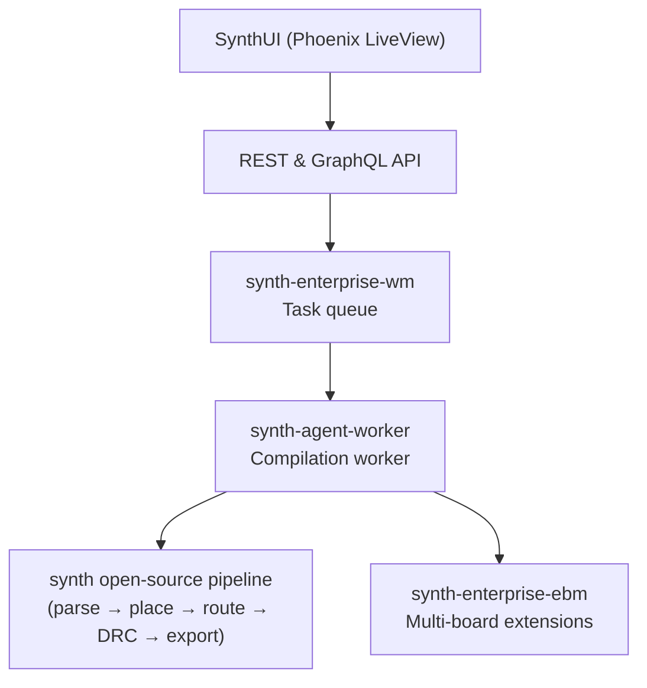

# Enterprise System Architecture

> [!NOTE]
> This page is for **Synth EE contributors and operators** who need to understand the `synth-ee` codebase. End users of Synth Enterprise Edition do not need this information.

The `synth-ee` workspace is a closed-source Cargo workspace that depends on pinned revisions of the open-source `synth` crates and adds proprietary extensions on top.

---

## Workspace Structure

```
synth-ee/
├── crates/
│   ├── synth-enterprise-ebm/   # Enterprise Board Management
│   └── synth-enterprise-wm/    # Worker Management
├── saas/                        # Phoenix LiveView web application (Elixir 1.17+) with SQLite via Ecto, Tailwind CSS, and DaisyUI
└── synth-agent-worker/          # Background worker binary
```

---

## Open-Source Dependency

`synth-ee` pins the open-source `synth` crates by Git revision in `Cargo.toml`. For local development and integration testing, a sibling checkout of the open-source repo is used instead:

```toml
[patch.crates-io]
synth-ir = { path = "../synth/crates/synth-ir" }
synth-place = { path = "../synth/crates/synth-place" }
# ... etc.
```

Maintain this sibling layout:

```
workspace/
├── synth/        # open-source repo (github.com/absmach/synth)
└── synth-ee/     # this repo
```

---

## Enterprise Crates

### `synth-enterprise-ebm` — Enterprise Board Management

Adds multi-board interconnect solving and high-speed differential pair constraints not present in the community edition. Consumes `synth-ir::DesignIR` and augments it with inter-board net references.

### `synth-enterprise-wm` — Worker Management

Implements the task queue protocol used by `synth-agent-worker`. Handles job dispatch, heartbeat tracking, worker node autoscaling signals, and result aggregation.

---

## Component Interaction


