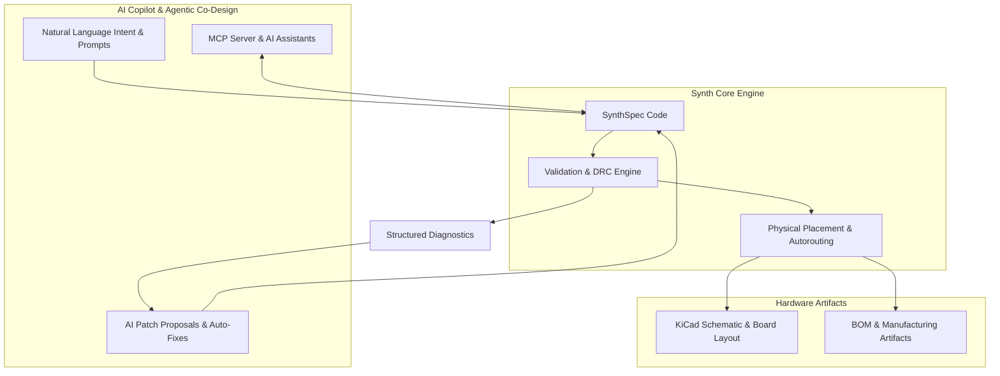

# Welcome to Synth

**Synth** is an open-source, AI-assisted PCB design platform and engine. Synth pairs AI copilot intelligence with a deterministic compiler engine to take hardware designs from high-level intent to production-ready circuit boards.

You can co-design with AI or describe your circuit directly in **SynthSpec** — a concise design language. Synth's AI copilot and compiler engine check your design for electrical and manufacturing rules, stream physical placement and autorouting, and export native KiCad schematics, PCB layouts, and bills of materials.

## What Synth Does

| Area | Capabilities |
| :--- | :--- |
| **AI-Assisted PCB Design** | Co-design with AI via conversational prompts, agentic workflows, interactive patch proposals, and MCP tool integration |
| **Design Language (SynthSpec)** | Expressive syntax for components, nets, differential pairs, keepout zones, and placement hints |
| **Validation & DRC** | Real-time electrical-rule checks (ERC), design-rule checks (DRC), structured JSON diagnostics, and auto-fixes |
| **Physical Synthesis** | GPU/CPU-accelerated DREAMPlace placement and Pathfinder autorouting with live convergence streaming |
| **KiCad & CAD Export** | Native KiCad schematic (`.kicad_sch`), PCB layout (`.kicad_pcb`), BOM CSV, and Gerber/drill exports |
| **Component Registry** | Integrated parts database with parametric search, LCSC part import, and custom part authoring |

---

## Editions

Synth is available in two editions:

| Capability | Community (Open Source) | Enterprise (Synth EE) |
| :--- | :---: | :---: |
| SynthSpec compiler & validation | ✅ | ✅ |
| AI Agent CLI & MCP server | ✅ | ✅ |
| KiCad, Gerber & BOM export | ✅ | ✅ |
| Component registry & LCSC import | ✅ | ✅ |
| Local live browser preview | ✅ | ✅ |
| AI Cockpit & Interactive CAD Canvas (SynthUI) | ❌ | ✅ |
| Multi-Model AI Copilot (Codex, Claude, Gemini) | ❌ | ✅ |
| Cloud placement & autorouting engine | ❌ | ✅ |
| Multi-tenant teams & SSO access control | ❌ | ✅ |
| Qualification & compliance audit trails | ❌ | ✅ |

> [!NOTE]
> Synth EE is closed source. The core Synth compiler, CLI, and MCP server are open source and free to use under the Apache 2.0 license.

---

## Get Started

- [Quick Start Guide](/user-guide/quick-start) — Build your first board in minutes.
- [AI Copilot & MCP Server](/user-guide/mcp-server) — Connect AI assistants to design boards interactively.
- [SynthSpec Reference](/user-guide/dsl-reference) — Learn the design language.
- [CLI Reference](/user-guide/cli) — All `synth` subcommands and flags.

